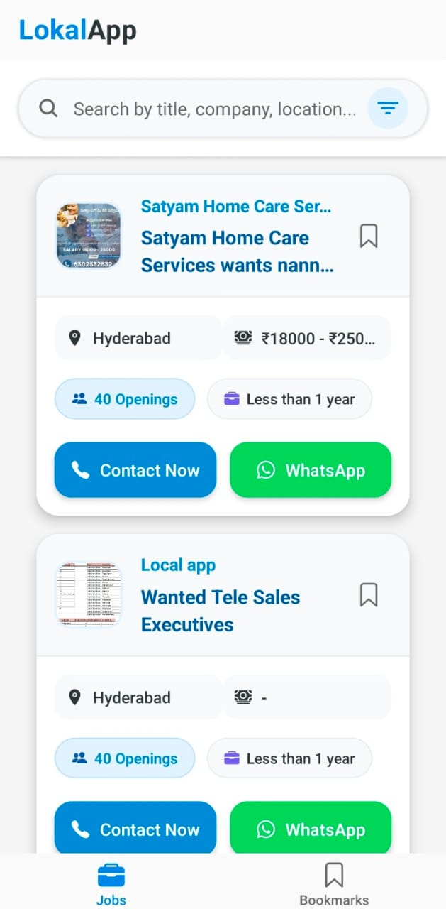
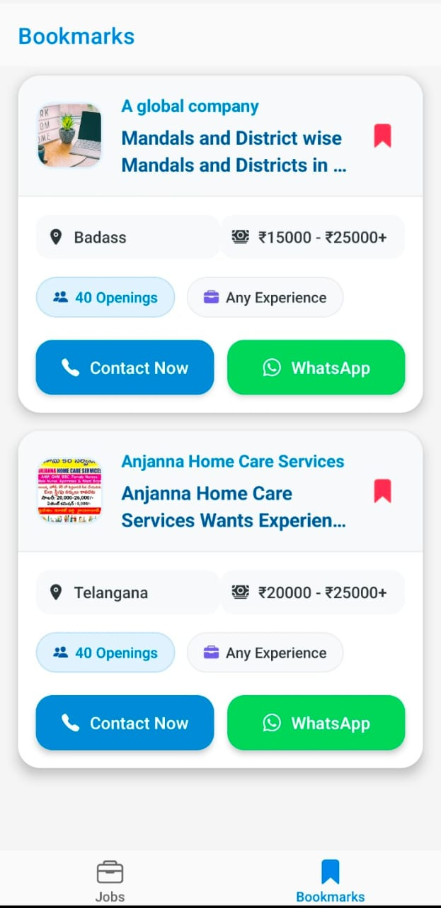
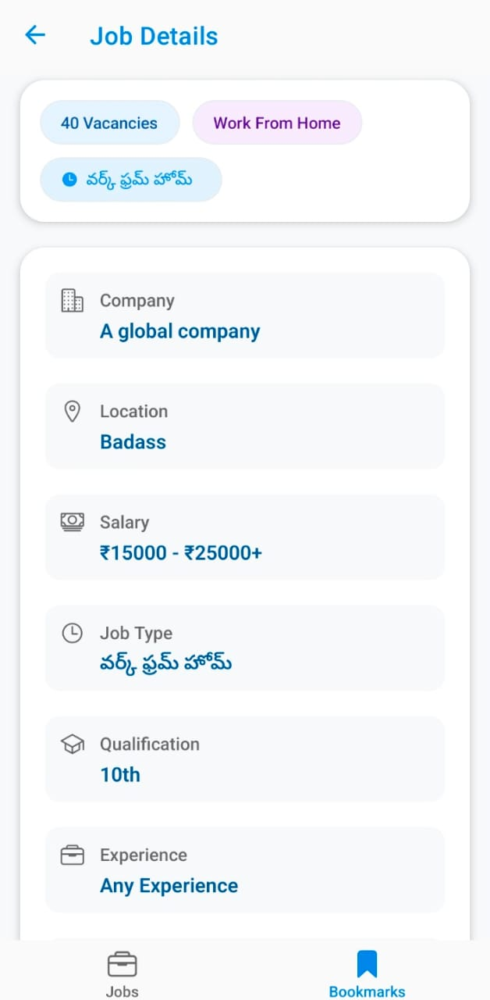
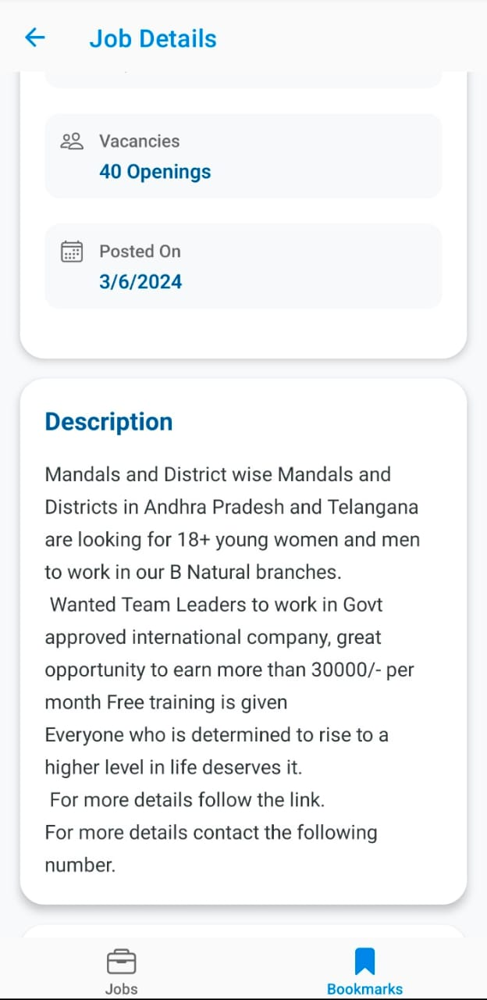
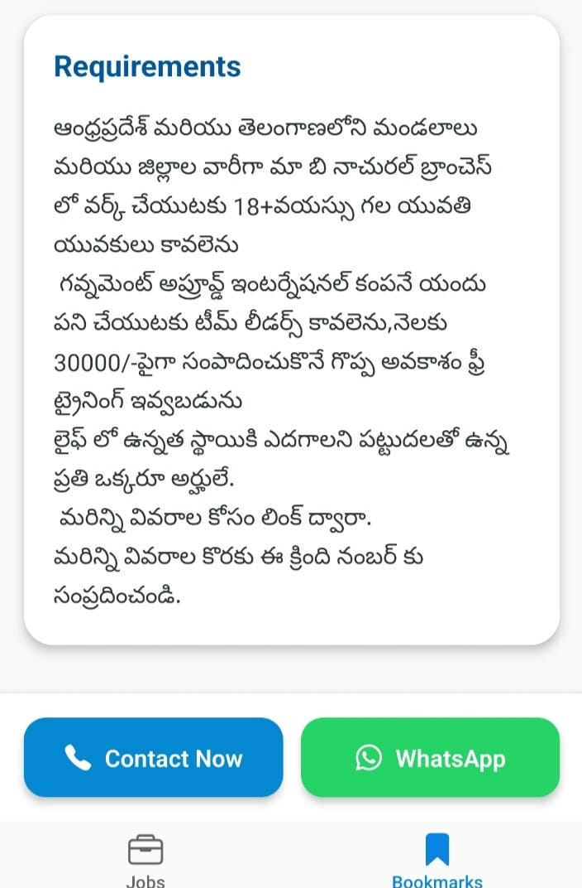
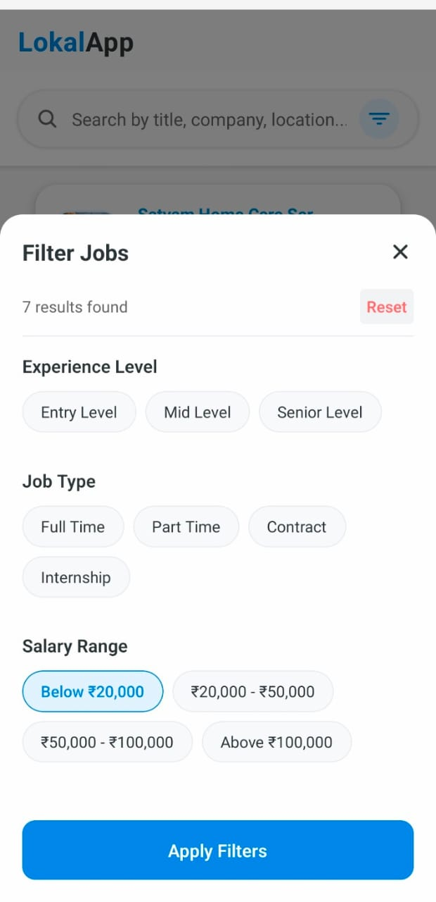

# LokalApp - Job Search Application

## 📱 Live Demo

Watch a complete walkthrough of the application:
[View Demo Video](https://drive.google.com/file/d/1UnNMkPpahD2iLqSQFX07M9OR87nPyFw3/view?usp=sharing)

## 🌟 Project Overview

LokalApp is a modern job search platform built with React Native that connects job seekers with local employment opportunities. The application features an intuitive user interface, powerful search and filtering capabilities, and bookmarking functionality to help users find and save relevant job listings.

<p align="center">
  
  
</p>

<p align="center">
  
  
</p>

<p align="center">
    
    
</p>

<p align="center">
    
</p>

## ✨ Key Features

### Job Discovery
- **Advanced Search** - Search jobs by title, company name, location, job type, and more
- **Smart Filtering** - Filter jobs by experience level, job type, and salary range
- **Real-time Results** - Instantly see matching job counts as you select filters

### User Experience
- **Intuitive Interface** - Clean, modern UI with smooth navigation
- **Responsive Design** - Optimized for both mobile devices and web browsers
- **Job Bookmarking** - Save interesting jobs for later viewing

### Technical Features
- **Efficient Data Loading** - Pagination support for handling large job lists
- **State Management** - Robust state handling across the application
- **Error Handling** - Graceful error management with user-friendly feedback

## 🔍 Core Functionality

### Jobs Screen
The main screen where users can:
- Browse available job listings
- Search for specific jobs using multiple criteria
- Apply filters to narrow down search results
- Bookmark interesting jobs
- Pull to refresh for the latest listings

### Job Details Screen
When selecting a job, users can:
- View comprehensive job information
- See company details, requirements, and responsibilities
- Bookmark/unbookmark jobs directly from the details view

### Bookmarks Screen
Users can:
- Access all saved job listings in one place
- Remove bookmarks as needed
- View full job details of saved listings

## 🛠️ Technologies Used

- **React Native** - Cross-platform mobile framework
- **Expo** - Development toolchain for React Native
- **React Navigation** - Navigation library for screen management
- **AsyncStorage** - Local data persistence
- **Axios** - API client for data fetching
- **Ionicons** - Icon library for UI elements

## 📋 Project Structure

```
lokal-app/
├── src/
│   ├── components/        # Reusable UI components
│   ├── screens/           # Main application screens
│   ├── navigation/        # Navigation configuration
│   ├── services/          # API services
│   └── database/          # Local storage utilities
├── assets/                # Images and static assets
└── app.json               # Application configuration
```

## 🚀 Installation Guide

1. **Clone the Repository**
   ```bash
   git clone https://github.com/shuklaAlkesh/Lokal-react-native-assignment.git
   cd Lokal-react-native-assignment
   ```

2. **Install Dependencies**
   ```bash
   npm install
   # or
   yarn install
   ```

3. **Start the Development Server**
   ```bash
   npx expo start
   ```

4. **Run on Device or Emulator**
   - Press `a` to run on Android emulator
   - Press `i` to run on iOS simulator
   - Scan QR code with Expo Go app on your device

## 💡 Implementation Highlights

### Search Functionality
The application implements a powerful search system that allows users to find jobs based on multiple criteria including:
- Job title
- Company name
- Location
- Experience level
- Job type
- Qualifications

### Filter System
The filter modal provides an intuitive way to refine job searches:
- Experience level filters (Entry, Mid, Senior)
- Job type filters (Full-time, Part-time, Contract, Internship)
- Salary range filters

### Performance Optimization
- Memoized components to prevent unnecessary re-renders
- Efficient state management using React hooks
- Asynchronous operations to maintain UI responsiveness
